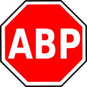

# Adblock Plus

Adblock Plus (ABP) to popularna wtyczka do przeglądarek internetowych, która służy do blokowania reklam. Jest dostępna dla wielu przeglądarek, w tym Chrome, Firefox, Edge, Safari oraz Opera. Dzięki niej użytkownicy mogą przeglądać strony internetowe bez uciążliwych reklam, co przyczynia się do szybszego ładowania stron, zmniejszenia zużycia danych oraz poprawy prywatności.

<figure markdown="span">
  { width="200" }
  <figcaption>Logo ABP</figcaption>
</figure>

!!! tip
    Link do strony [Adblock Plus](https://adblockplus.org/), na której dowiesz się więcej o jego funkcjonalnościach i konfiguracji.

Adblock Plus działa poprzez filtrowanie ruchu sieciowego i blokowanie elementów zawierających reklamy na podstawie list filtrów, które są regularnie aktualizowane. Użytkownicy mogą także tworzyć własne filtry i dostosowywać działanie wtyczki do swoich potrzeb. Jednym z unikalnych aspektów ABP jest funkcja „Acceptable Ads”, która domyślnie pozwala na wyświetlanie nieinwazyjnych reklam, wspierając tym samym witryny, które polegają na przychodach z reklam. Ta opcja może być jednak wyłączona w ustawieniach wtyczki.

Adblock Plus zdobył dużą popularność dzięki swojej skuteczności i łatwości użytkowania, stając się narzędziem pierwszego wyboru dla wielu internautów pragnących kontrolować swoją aktywność online i uniknąć niechcianych treści reklamowych.

<figure markdown="span">
  { width="500" }
  { width="500"}
  <figcaption>Przed i po zainstalowaniu wtyczki</figcaption>
</figure>

Rozwiązanie posiada także płatną (dość drogą) wersję Premium, która oprócz usprawnień automatyzuje wiele zadań, takich jak potwierdzanie informacji o ciasteczkach, przy pierwszym wejściu na witrynę.