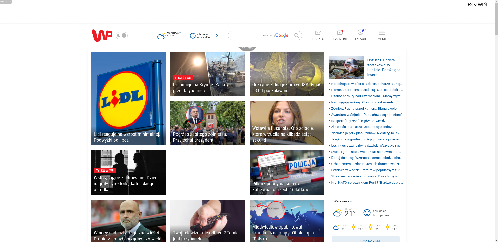

# uBlock Origin

uBlock Origin to efektywna wtyczka do przeglądarek internetowych, zaprojektowana do blokowania reklam i innych niechcianych treści. Jest dostępna dla popularnych przeglądarek, takich jak Chrome, Firefox, Edge, Opera oraz Safari. Dzięki uBlock Origin użytkownicy mogą cieszyć się szybszym ładowaniem stron, zmniejszonym zużyciem danych oraz lepszą prywatnością w sieci.

<figure markdown="span">
  { width="200" }
  <figcaption>Logo uBlock Origin</figcaption>
</figure>

!!! tip
    Link do strony [uBlock Origin](https://ublockorigin.com/pl), na której dowiesz się więcej o jego funkcjonalnościach i konfiguracji.

Jedną z głównych zalet uBlock Origin jest to, że jest to projekt otwartoźródłowy. Oznacza to, że jego kod jest publicznie dostępny i może być modyfikowany przez społeczność programistów. Dzięki temu uBlock Origin może szybciej reagować na zmiany wprowadzane przez strony internetowe, które starają się ominąć blokady reklam. 
Dodatkowo jest to rozwiązanie bezpieczniejsze, bo nad działaniem wtyczki zgodnie z założeniami czuwa większa ilość osób. W przeszłości zdarzały się sytuacje, gdzie niektóre adblocki zawierały porozumienie z niektórymi podmiotami, by nie blokować niektórych reklam.

uBlock Origin oferuje zaawansowane możliwości konfiguracyjne, pozwalając użytkownikom dostosować działanie wtyczki do swoich indywidualnych potrzeb. Użytkownicy mogą tworzyć i udostępniać własne filtry, co zwiększa elastyczność i skuteczność wtyczki. Pomimo zaawansowanych funkcji, uBlock Origin jest prosty w obsłudze i przyjazny dla użytkownika. Jego lekka konstrukcja sprawia, że zużywa mniej zasobów systemowych w porównaniu do innych narzędzi tego typu.

Dzięki swojej skuteczności, otwartoźródłowej naturze i dużej społeczności wspierającej, uBlock Origin jest doskonałym wyborem dla tych, którzy chcą kontrolować swoją aktywność online i blokować niechciane reklamy oraz inne niepożądane treści.

Wtyczka blokuje także promowane za opłatą posty na platformach SM, takich jak Twitter i Facebook.

<figure markdown="span">
  { width="500" }
  { width="500"}
  <figcaption>Przed i po zainstalowaniu wtyczki</figcaption>
</figure>